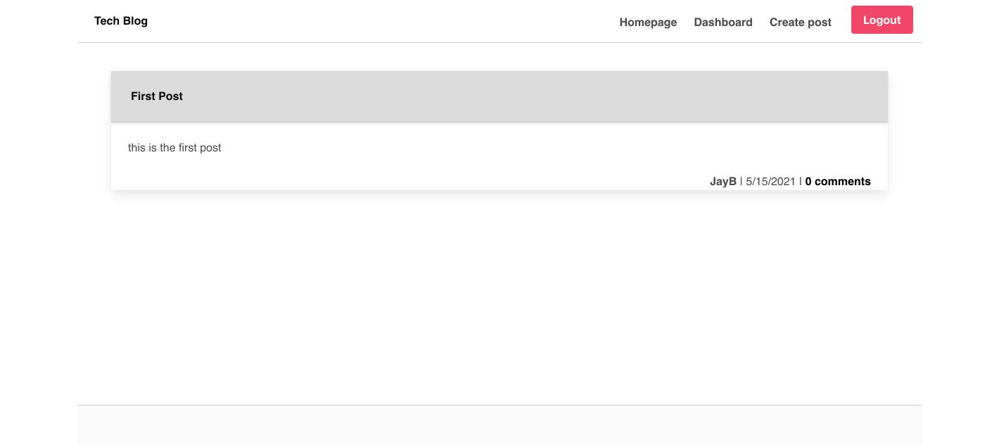

# Model-View-Controller--MVC--Tech-Blog


[](https://spdx.org/licenses/MIT.html)
 ## Table of Contents
1. [Description](#description)

2. [Acceptance Criteria](#Acceptance-Criteria)

3. [Installation](#installation)

4. [Usage](#usage)

5. [Links](#links)

6. [Contributions](#contributions)

7. [Questions](#questions)


## Description


Writing about tech can be just as important as making it. Developers spend plenty of time creating new applications and debugging existing codebases, but most developers also spend at least some of their time reading and writing about technical concepts, recent advancements, and new technologies. A simple Google search for any concept covered in this course returns thousands of think pieces and tutorials from developers of all skill levels!

Your task this week is to build a CMS-style blog site similar to a Wordpress site, where developers can publish their blog posts and comment on other developers’ posts as well. You’ll build this site completely from scratch and deploy it to Heroku. Your app will follow the MVC paradigm in its architectural structure, using Handlebars.js as the templating language, Sequelize as the ORM, and the express-session npm package for authentication.

## Acceptance-Criteria

```md
AS A developer who writes about tech
I WANT a CMS-style blog site
SO THAT I can publish articles, blog posts, and my thoughts and opinions
```

```md
GIVEN a CMS-style blog site
WHEN I visit the site for the first time
THEN I am presented with the homepage, which includes existing blog posts if any have been posted; navigation links for the homepage and the dashboard; and the option to log in
WHEN I click on the homepage option
THEN I am taken to the homepage
WHEN I click on any other links in the navigation
THEN I am prompted to either sign up or sign in
WHEN I choose to sign up
THEN I am prompted to create a username and password
WHEN I click on the sign-up button
THEN my user credentials are saved and I am logged into the site
WHEN I revisit the site at a later time and choose to sign in
THEN I am prompted to enter my username and password
WHEN I am signed in to the site
THEN I see navigation links for the homepage, the dashboard, and the option to log out
WHEN I click on the homepage option in the navigation
THEN I am taken to the homepage and presented with existing blog posts that include the post title and the date created
WHEN I click on an existing blog post
THEN I am presented with the post title, contents, post creator’s username, and date created for that post and have the option to leave a comment
WHEN I enter a comment and click on the submit button while signed in
THEN the comment is saved and the post is updated to display the comment, the comment creator’s username, and the date created
WHEN I click on the dashboard option in the navigation
THEN I am taken to the dashboard and presented with any blog posts I have already created and the option to add a new blog post
WHEN I click on the button to add a new blog post
THEN I am prompted to enter both a title and contents for my blog post
WHEN I click on the button to create a new blog post
THEN the title and contents of my post are saved and I am taken back to an updated dashboard with my new blog post
WHEN I click on one of my existing posts in the dashboard
THEN I am able to delete or update my post and taken back to an updated dashboard
WHEN I click on the logout option in the navigation
THEN I am signed out of the site
WHEN I am idle on the page for more than a set time
THEN I am automatically signed out of the site 
```


## Installation

Make sure to have node.js installed before running application.
if not please go here https://nodejs.org/en/download/package-manager/

Once Node.js is installed please enter the following:
```
npm init
npm install


```

## Usage


Navigate to the seeds folder and run the following command in Terminal/Bash to seed database 

```
npm run seed

```

Run the following command in Terminal/Bash to start server.

```
npm start
```


### Links

[Deployed Github Repo] https://github.com/Jbarbss/Model-View-Controller--MVC--Tech-Blog

[Heroku Site] https://still-scrubland-37470.herokuapp.com/



 
## Contributions
---
[](https://github.com/bdurham227)

[](https://github.com/samohtebag)

[](https://github.com/pat31477)


## Questions
 ---
  Please email me with any question regarding this project @ JBarbanel@gmail.com and connect with me on Github and LinkedIn.
 

  [](https://github.com/jbarbss) 


  [](https://www.linkedin.com/in/jason-barbanel/)

Copyright (c) 2021 Jason Barbanel


## License
 
[](https://spdx.org/licenses/MIT.html)

   https://opensource.org/licenses/MIT

Licensed under the MIT License

Copyright © [2021] [Jason Barbanel]
    
 Permission is hereby granted, free of charge, to any person obtaining a copy of this software and associated documentation files (the "Software"), to deal in the Software without restriction, including without limitation the rights to use, copy, modify, merge, publish, distribute, sublicense, and/or sell copies of the Software, and to permit persons to whom the Software is furnished to do so, subject to the following conditions:
        
The above copyright notice and this permission notice shall be included in all copies or substantial portions of the Software.
        
THE SOFTWARE IS PROVIDED "AS IS", WITHOUT WARRANTY OF ANY KIND, EXPRESS OR IMPLIED, INCLUDING BUT NOT LIMITED TO THE WARRANTIES OF MERCHANTABILITY, FITNESS FOR A PARTICULAR PURPOSE AND NONINFRINGEMENT. IN NO EVENT SHALL THE AUTHORS OR COPYRIGHT HOLDERS BE LIABLE FOR ANY CLAIM, DAMAGES OR OTHER LIABILITY, WHETHER IN AN ACTION OF CONTRACT, TORT OR OTHERWISE, ARISING FROM, OUT OF OR IN CONNECTION WITH THE SOFTWARE OR THE USE OR OTHER DEALINGS IN THE SOFTWARE


